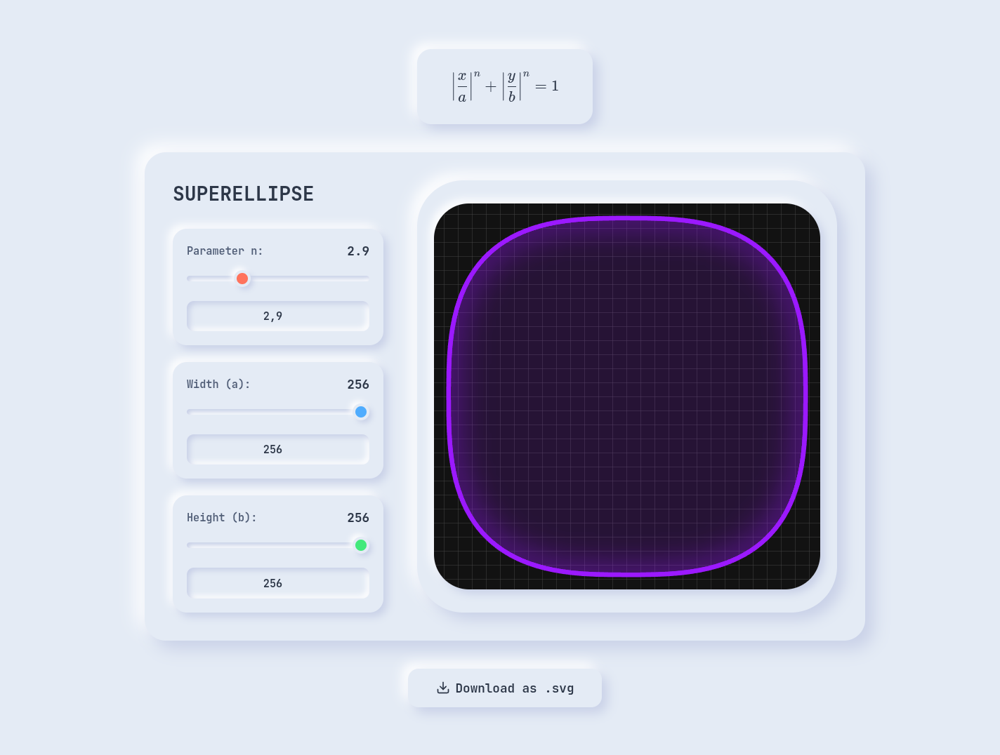

# SUPERELLIPSE

My initial testrun of Google Antigravity. Drawing a superellipse using P5js.

This code is partly hand-written and AI generated. Please use AS-IS.
No garantees of correctness. Use at your own risk.

The super ellipse formula is given by:
|x/a|^n + |y/b|^n = 1

Where n > 0 is the parameter that controls the shape of the ellipse.
a and b are the semi-major and semi-minor axes of the ellipse.

Made famous by the Danish architect Piet Hein, and the Swedish mathematician H. G. Forder. Used in the construction of the new Parliament house in Stockholm. The equation was first discovered by the French mathematician Alexis Clairaut in 1742, but it was not widely used until it was rediscovered by Piet Hein in the 1950s.

The super ellipse table top design by Piet Hein is a classic example of how this shape can be used to create functional art. Another well known example of superellipse is the shape of the pedestrian street the Sergels Torg in Stockholm.

